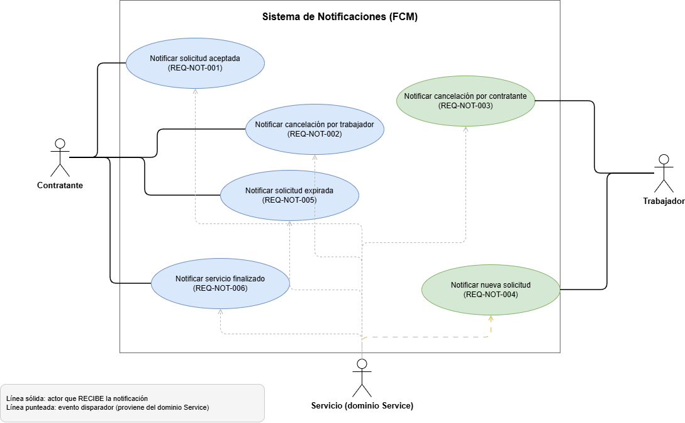

# oficioya-notification

## Requerimientos Funcionales - Dominio Notification

| | |
|---|---|
| **Proyecto** | OficioYa |
| **Squad** | 4 |
| **Dominio** | Notification |
| **Tecnología Principal** | Firebase Cloud Messaging (FCM) |

## 1. Eventos y Disparadores (Triggers)

Este dominio se encarga exclusivamente de comunicar eventos relevantes a los usuarios a través de notificaciones.

| ID | Descripción |
|---|---|
| **REQ-NOT-001** | El sistema debe enviar una notificación al contratante en el momento en que un trabajador acepta su solicitud de servicio. |
| **REQ-NOT-002** | El sistema debe enviar una notificación al contratante cuando el trabajador cancela un servicio previamente aceptado. |
| **REQ-NOT-003** | El sistema debe enviar una notificación al trabajador cuando el contratante cancela un servicio previamente aceptado. |
| **REQ-NOT-004** | El sistema debe enviar una notificación al trabajador (o trabajadores) en el instante en que el contratante les envía una nueva solicitud de servicio. |
| **REQ-NOT-005** | El sistema debe enviar una notificación al contratante si su solicitud alcanza el límite de 30 minutos sin ser aceptada y cambia a estado *Expirada*. |
| **REQ-NOT-006** | El sistema debe enviar una notificación al contratante cuando el trabajador reporta que el servicio ha sido finalizado o cumplido. |

## 2. Diagrama de Casos de Uso

*(Los diagramas se elaboraron sin mockups de interfaz gráfica, cumpliendo las restricciones del Sprint 1).*

