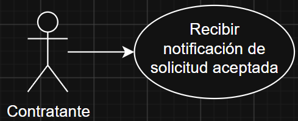
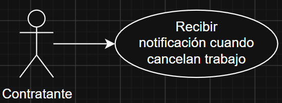
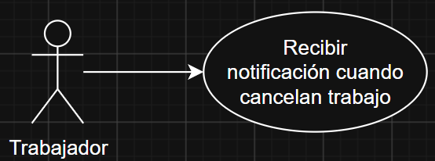
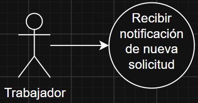
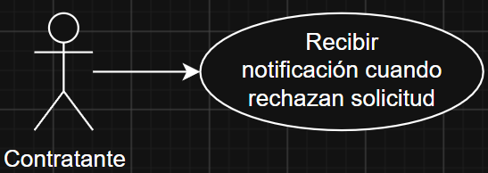
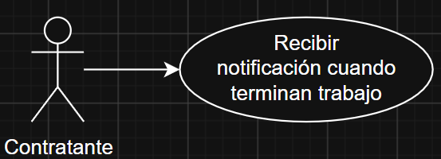

# 📄 Requerimientos del Sistema

## 1. Lista general de requerimientos

El sistema de notificación de OficioYa tiene los siguientes requerimientos: Debe permitir enviar notificaciones a trabajadores y contratantes dependiendo de las acciones que lo requieran.

### 1.1 Requerimientos funcionales

El sistema de notificación de OficioYa debe tener la capacidad de:

1. El sistema debe enviar una notificación al contratante en el momento en que un trabajador acepta su solicitud de servicio.
2. El sistema debe enviar una notificación al contratante cuando el trabajador cancela un servicio previamente aceptado.
3. El sistema debe enviar una notificación al trabajador cuando el contratante cancela un servicio previamente aceptado.
4. El sistema debe enviar una notificación al trabajador (o trabajadores) en el instante en que el contratante les envía una nueva solicitud de servicio.
5. El sistema debe enviar una notificación al contratante si su solicitud fue rechazada.
6. El sistema debe enviar una notificación al contratante cuando el trabajador reporta que el servicio ha sido finalizado o cumplido.

### 1.2 Requerimientos no funcionales

El sistema de notificación de OficioYa debe tener:

1. La primera línea de la notificación push describe la ocasión de la notificación (Solicitud aceptada, Solicitud entrante, Solicitud rechazada, Trabajo cancelado, Trabajo terminado).
2. Si la notificación push es de una solicitud entrante, esta tendrá la foto que el usuario envió, el día y hora del trabajo y la localización del trabajo.
3. Si la notificación push es de una solicitud rechazada, esta dirá con qué trabajador fue, qué día y a qué horas era el trabajo.
4. Si la notificacion push es de una solicitud aceptada, esta dirá con qué trabajador fue, qué día y a qué horas es el trabajo.
5. Si la notificacion push es de un trabajo cancelado por el contratante, esta dirá con qué contratante fue, qué día y a qué horas es el trabajo.
6. Si la notificacion push es de un trabajo cancelado por el trabajador, esta dirá con qué trabajador fue, qué día y a qué horas es el trabajo.
7. Si la notificacion push es de un trabajo terminado, esta dirá con qué trabajador fue, qué día y a qué horas es el trabajo.

## 2. Diagramas de caso de uso

### 2.1 Requerimiento Funcional 1

| Campo | Descripción |
|------|-------------|
| **ID** | REQ-NOT-001 |
| **Nombre del requerimiento** | Notificación al aceptar una solicitud |
| **Descripción** | El sistema debe enviar una notificación push al contratante en el momento en que un trabajador acepta su solicitud de servicio. |
| **Precondiciones** | Para que el sistema cumpla con este requerimiento, el trabajador debe de tener el tiempo disponible para aceptar la solicitud, debe de haber aceptado la solicitud. |
| **Actor** | Contratante, trabajador y sistema de solicitudes. |
| **Flujo principal** | 1. El trabajdor revisa las solicitudes que tiene abiertas. 2. El trabajador escoge la que más le convenga.  3. El sistema revisa que no interfiera con las ya aceptadas.  4. Se le permite al trabajador aceptar la solicitud del contratante. 5. Se actualiza el estado de la solicitud. 6. Se le envía notificación al contratante que su solicitud fue aceptada. |
| **Diagrama de caso de uso** |  |
| **Poscondiciones** | La solicitud aceptada y la notificación llegando al contratante. |

### 2.2 Requerimiento Funcional 2

| Campo | Descripción |
|------|-------------|
| **ID** | REQ-NOT-002 |
| **Nombre del requerimiento** | Notificación cuando el trabajador cancela un servicio aceptado |
| **Descripción** | El sistema debe enviar una notificación push al contratante cuando el trabajador cancela un servicio previamente aceptado. |
| **Precondiciones** | Para que el sistema cumpla con este requerimiento, el trabajador ya debe tener una solicitud aceptada del contratante al que se le va a enviar la notificación. |
| **Actor** | Contratante y trabajador. |
| **Flujo principal** | 1. El trabajador escoge una solicitud aceptada. 2. El trabajador escoge cancelar la solicitud de trabajo. 3. El sistema envía una notificación al contratante de que su solicitud fue rechazada. |
| **Diagrama de caso de uso** |  |
| **Poscondiciones** | Se espera como resultado la solicitud rechazada y la notificación enviada al contratante. |

### 2.3 Requerimiento Funcional 3

| Campo | Descripción |
|------|-------------|
| **ID** | REQ-NOT-003 |
| **Nombre del requerimiento** | Notificación cuando el contratante cancela un servicio aceptado |
| **Descripción** | El sistema debe enviar una notificación push al trabajador cuando el contratante cancela un servicio previamente aceptado. |
| **Precondiciones** | Para que el sistema cumpla con este requerimiento, el trabajador ya debe de haber aceptado una solicitud de trabajo,la solicitud le aparece como aceptada al contratante debede ser cancelada antes de la hora y día del trabajo. |
| **Actor** | Contratante y trabajador. |
| **Flujo principal** | 1. El contratante revisa los trabajos próximos. 2. El contratante escoge un trabajo y lo cancela. 3. El sistema envía una notificación al trabajador de que el trabajo fue cancelado. |
| **Diagrama de caso de uso** |  |
| **Poscondiciones** | Se espera como resultado que el trabajo quede cancelado y que le llegue una notificación al trabajador. |

### 2.4 Requerimiento Funcional 4

| Campo | Descripción |
|------|-------------|
| **ID** | REQ-NOT-004 |
| **Nombre del requerimiento** | Notificación al enviar solicitudes de servicio |
| **Descripción** | El sistema debe enviar una notificación push al trabajador (o trabajadores) en el instante en que el contratante les envía una nueva solicitud de servicio. |
| **Precondiciones** | Para que el sistema cumpla con este requerimiento, los datos de la solicitud deben ser correctos. |
| **Actor** | Contratante y trabajador/es. |
| **Flujo principal** | 1. El contratante termina de llenar los datos de su solicitud. 2. El contratante envía la solicitud a un o a muchos trabajadores. 3. El sistema envía la notificación de nueva solicitud al trabajador o trabajadores. |
| **Diagrama de caso de uso** |  |
| **Poscondiciones** | La/s solicitud/es creadas y la/s notificacion/es enviadas al trabajador o trabajadores. |

### 2.5 Requerimiento Funcional 5

| Campo | Descripción |
|------|-------------|
| **ID** | REQ-NOT-005 |
| **Nombre del requerimiento** | Notificación cuando el trabajador rechaza una solicitud de servicio |
| **Descripción** | El sistema debe enviar una notificación push al contratante si su solicitud fue rechazada. |
| **Precondiciones** | Para que el sistema cumpla con este requerimiento, el contratante debe de haber creado y enviado la solicitud, la solicitud le debe de haber llegado al trabajador. |
| **Actor** | Contratante y trabajador. |
| **Flujo principal** | 1. La notificación está en la bandeja de solicitudes del trabajador. 2. El trabajador escoge una de las solicitudes que tenga. 3. El trabajador rechaza la solicitud. 4. El sistema envía una notificación al contratante de que su solicitud fue rechazada. |
| **Diagrama de caso de uso** |  |
| **Poscondiciones** | Se espera como resultado la solicitud rechazada y la notificación enviada al contratante. |

### 2.6 Requerimiento Funcional 6

| Campo | Descripción |
|------|-------------|
| **ID** | REQ-NOT-006 |
| **Nombre del requerimiento** | Notificación al terminar el servicio |
| **Descripción** | El sistema debe enviar una notificación push al contratante cuando el trabajador reporta que el servicio ha sido finalizado o cumplido. |
| **Precondiciones** | Para que el sistema cumpla con este requerimiento, la solicitud de trabajo ya debe de haber sido aceptada, el tiempo a aceptar es después de la hora del trabajo. |
| **Actor** | Contratante y trabajador. |
| **Flujo principal** | 1. El trabajador termina el trabajo pedido. 2. El trabajador ingresa en la solicitud que terminó el trabajo. 3. El sistema envía una notificación al contratante de que el trabajo fue realizado. |
| **Diagrama de caso de uso** |  |
| **Poscondiciones** | Se espera como resultado la solicitud como terminada y la notificación enviada al contratante. |